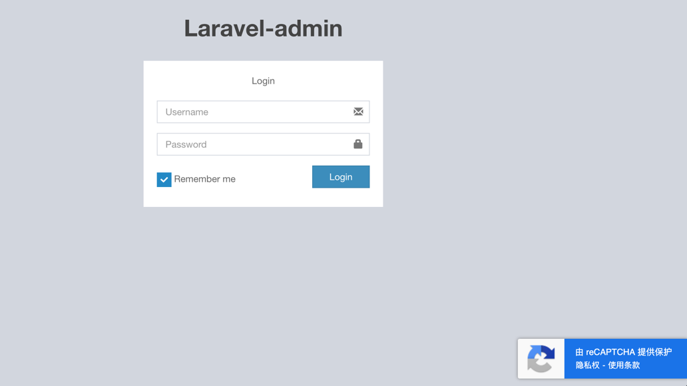

google reCaptcha for laravel-admin
======
Add Google reCAPTCHA(no perception) for laravel-admin

## Screenshot


## Installation
```bash
composer require lyne007/auth-recaptcha
```
## Configuration
1. In the extensions section of the `config/admin.php` file, add configurations
```php
'extensions' => [
    'auth-recaptcha' => [
        // set to false if you want to disable this extension
        'enable' => true,
        // set to false if you want to disable icon
        'iconDisplay' => true,
        // reCAPTCHA:v3 keys  
        'siteKey' => 'your google reCAPTCHA site key',
        'secretKey'  => 'your google reCAPTCHA secret key',
    ]
],
```
> Register and get reCAPTCHA keys;
> https://www.google.com/recaptcha 

2. Exclude CAPTCHA Interface Restrictions
In the excepts section of the `config/admin.php` file, add configurations
```php
'excepts' => [
    'auth/login',
    'auth/logout',
    // add
    'auth/api/recaptcha' 
],
```
## Usage
Open your login page in your browser

## License
Licensed under [MIT License]("https://github.com/lyne007/auth-recaptcha/blob/master/LICENSE")

